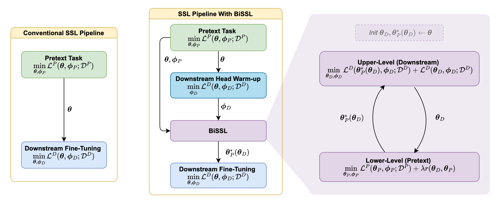

# BiSSL: Enhancing the Alignment Between Self-Supervised Pre-Training and Downstream Fine-Tuning via Bilevel Optimization
This repository holds the pytorch-implementation accompanying the paper on BiSSL (submitted to NeurIPS 2025). The implementation is verified to work for single-node multi-gpu (cuda) setups using Pytorch 2.1.2.


## Pre-Trained Model Weights
Per default, all model weights and configs shall be stored in the *models*-folder of the root dir. If the the models/configs are stored in another dir, specify this using the *--model-root* argument. Pre-trained model weights and configs used for the experiments in the paper are available for download [here](https://drive.google.com/drive/folders/120GUKlcpeh3rhKq9W_-6lSHCKWhQx7gB?usp=share_link).

## Overview of main training scripts:
We provide code for the training via SimCLR/BYOL pretext task and downstream classification/object detection tasks. The source BiSSL trainer code is located in *source/bissl/bissl_trainer.py*.

### 1. Self-Supervised Pre-Training (*runs/pretext/*)
The dir *runs/pretext/* contains the main code for conducting self-supervised pretraining. See *runs/pretext/config.py* for possible arguments to parse.

To run SimCLR with 4 GPUs and the same hyperparameters as specified for the baseline setup in the paper, run the following:
```
torchrun --nproc-per-node 4 runs/pretext/simclr/run.py --root 'PATH_TO_ROOT'
```
The file *runs/pretext/simclr/config.py* contains arguments specifically put for SimCLR.

Similarly for BYOL:
```
torchrun --nproc-per-node 4 runs/pretext/byol/run.py --root 'PATH_TO_ROOT'
```
Which has config located in *runs/pretext/byol/config.py*.

### 2. BiSSL
The current codebase supports BiSSL with either SimCLR and BYOL as pretext task and either classification or object detection as downstream task.

The main code for conducting BiSSL is located in *runs/bissl*. See *runs/bissl/config.py* for the general BiSSL arguments.

##### Classification (*runs/bissl/classification*)
To conduct the linear downstream head warmup followed by BiSSL on the Oxford-IIIT Pets dataset for classification, using the SimCLR self-supervised pre-trained model parameters as specified in the paper (i.e. achieved by running the line above), run:
```
torchrun --nproc-per-node 4 runs/bissl/classification/simclr/run.py --root 'PATH_TO_ROOT' --pretrained_model_backbone 'Pretext_simclr_arch-resnet50_backbone_id-hb63rtyl.pth' --pretrained_model_head 'Pretext_simclr_arch-resnet50_head_id-hb63rtyl.pth' --pretrained_model_config 'Pretext_simclr_arch-resnet50_config_id-hb63rtyl.json' --d-dataset 'pets' --d-lr 0.03 --d-wd 0.001
```
The pretrained model weights and corresponding config has to be specified, as outlined in the line above.

See *runs/bissl/classification/config.py* for additional classification specific arguments to parse. Similar see *runs/bissl/classification/simclr/config.py* and *runs/bissl/classification/byol/config.py* for SimCLR and BYOL specific arguments in BiSSL.

##### Object Detection (*runs/bissl/object_detection*)
To conduct the linear downstream head warmup followed by BiSSL on the VOC07+12 dataset for object detection, using the SimCLR self-supervised pre-trained model parameters as specified in the paper (i.e. achieved by running the line above), run:
```
torchrun --nproc-per-node 4 runs/bissl/object_detection/simclr/run.py --root 'PATH_TO_ROOT' --pretrained_model_backbone 'Pretext_simclr_arch-resnet50_backbone_id-hb63rtyl.pth' --pretrained_model_head 'Pretext_simclr_arch-resnet50_head_id-hb63rtyl.pth' --pretrained_model_config 'Pretext_simclr_arch-resnet50_config_id-hb63rtyl.json' --d-dataset 'voc07+12detection'
```
See *runs/bissl/object_detection/config.py* for additional object detection specific arguments to parse. Similar see *runs/bissl/object_detection/simclr/config.py* and *runs/bissl/object_detection/byol/config.py* for SimCLR and BYOL specific arguments in BiSSL.

### 3. Fine-Tuning (*fine-tuning.py*)
The current codebase supports fine-tuning for classification and object detection tasks respectively.


The main code for conducting fine-tuning is located in *runs/fine_tune*.See *runs/fine_tune/config.py* for the general fine-tuning arguments.

##### Classification (*runs/fine_tune/classification*)
To conduct hyper-parameter optimization by conducting a random grid search over 100 combinations of learning rates and weight decays (as specified in the paper) used for fine-tuning a self-supervised pre-trained backbone via SimCLR on the pets dataset, run the following line
```
torchrun --nproc-per-node 4 runs/fine_tune/classification/resnet/post_pretext_ft/run.py --root 'PATH_TO_ROOT' --pretrained_model_backbone 'Pretext_simclr_arch-resnet50_backbone_id-hb63rtyl.pth' --pretrained_model_config 'Pretext_simclr_arch-resnet50_config_id-hb63rtyl.json' --dset 'pets' --num-runs 100 --use-hpo 1
```

To conduct a similar run, but with a backbone obtained using BiSSL instead, run the following:
Post BiSSL
```
torchrun --nproc-per-node 4 runs/fine_tune/classification/resnet/post_bissl_ft/run.py --root 'PATH_TO_ROOT' --pretrained_model_backbone 'BiSSL_simclr_classification_pets_arch-resnet50_lower_backbone_id-izqrdr53.pth' --pretrained_model_config 'BiSSL_simclr_classification_pets_arch-resnet50_config_id-izqrdr53.json' --num-runs 100 --use-hpo 1
```

To conduct 10 fine-tunings with different random seeds (post BiSSL) on the pets dataset without HPO and instead using given hyperparameters, all using the same specified learning rates and weight decays, run:
```
torchrun --nproc-per-node 4 runs/fine_tune/classification/resnet/post_bissl_ft/run.py --root 'PATH_TO_ROOT' --pretrained_model_backbone 'BiSSL_simclr_classification_pets_arch-resnet50_lower_backbone_id-izqrdr53.pth' --pretrained_model_config 'BiSSL_simclr_classification_pets_arch-resnet50_config_id-izqrdr53.json' --num-runs 10 --use-hpo 0 --lr 0.03 --wd 0.001
```

See *runs/fine_tune/classification/config.py* for classification fine-tuning specific arguments to parse. 

##### Object Detection (*runs/fine_tune/object_detection*)
The object detection fine-tuning code executes in a similar manner to classification:
```
torchrun --nproc-per-node 4 runs/fine_tune/object_detection/resnet/post_pretext_ft/run.py --root 'PATH_TO_ROOT' --pretrained_model_backbone 'Pretext_simclr_arch-resnet50_backbone_id-hb63rtyl.pth' --pretrained_model_config 'Pretext_simclr_arch-resnet50_config_id-hb63rtyl.json' --dset 'voc07+12detection' --num-runs 100 --use-hpo 1
```

See *runs/fine_tune/object_detection/config.py* for additional classification fine-tuning specific arguments to parse. 
